# Welcome

 &nbsp;&nbsp;&nbsp;&nbsp;&nbsp;
  

### About me

As an Android app developer, I have a passion for creating beautiful and functional apps for users. I write code primarily in Kotlin, which is a popular programming language for Android development. My focus is on creating a visually appealing and intuitive user experience that makes using the app a pleasure.

I believe that a good app should not only be functional but also look great. Therefore, I pay close attention to design and user interface to create a seamless experience for users. I strive to ensure that the app is easy to navigate and provides the necessary functionality without overwhelming the user.

I enjoy learning about new tools and techniques that can improve the app development process. I also collaborate with designers, product managers, and other developers to ensure that the team is aligned and working towards a common goal. I am always open to feedback and willing to adjust my approach to create better apps.

[Github](https://github.com/amitthecoder)  |  [Linkedln](https://www.linkedin.com/in/amitthecoder)  |  [YouTube](https://www.youtube.com/@amitthecoders)  |  [Play Store](https://play.google.com/store/apps/dev?id=8173184158513909416)  |  [Codeforces](https://codeforces.com/profile/amitthecoder_)  |  [Google Developer](https://g.dev/amitthecoder)

  
  
  
  
  
  
  
  
  
  
  

| Overview | Follow up Issues & PRs |
|:--------:|:-------------------------:|
|  |  |
| Achievements | Language Activity |
|  |  |
| Discussions | Reactions |
|  |  |

